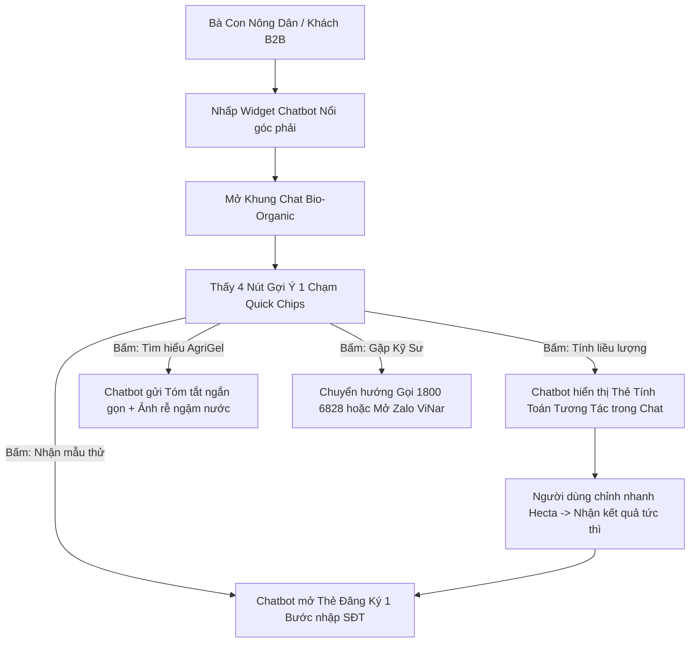

# BÁO CÁO ĐÁNH GIÁ THIẾT KẾ & ĐỀ XUẤT HIỆU CHỈNH TỐI ƯU HÓA UX (TEXT-FIRST CHATBOT)
## Dự án: ViNar (VinaGreen) Circular AgriTech Platform
**Tài liệu tham chiếu:** `docs/[ViNar] Nghiên cứu Insight Thiết kế Website.md`, `docs/DESIGN.md`, và các bản mẫu trong `stitch_vinar_circular_agritech_platform`.
**Định hướng cập nhật:** Tập trung chuyên biệt vào **Giao diện Chatbot Văn bản Tương tác (Custom Text Chatbot)**, loại bỏ chế độ Voice nhằm tối ưu chi phí vận hành ban đầu, tăng tính thực dụng và tương thích tối đa với mọi thiết bị di động của bà con nông dân.

---

## 1. TỔNG QUAN ĐÁNH GIÁ & BỐI CẢNH NGƯỜI DÙNG

Bản thiết kế mẫu Google Stitch (`stitch_vinar_circular_agritech_platform`) đã thể hiện rất tốt ngôn ngữ thị giác **"Bio-Organic Modernism"**: màu sắc thiên nhiên hữu cơ, typography rõ ràng (Epilogue + Plus Jakarta Sans), hình ảnh thực nghiệm phòng lab kết hợp ruộng vườn chân thực.

Tuy nhiên, giao diện hiện tại bộc lộ nhiều điểm nghẽn trải nghiệm (UX Friction) đối với 3 nhóm đối tượng:
1. **Bà con Nông dân (End-users):** Ngại gõ chữ dài trên điện thoại, khó thao tác khi tay ướt, dễ nản nếu form quá nhiều trường nhập liệu.
2. **Đối tác Hợp tác xã & Smart Farm (B2B):** Cần công cụ tư vấn nhanh, tính toán liều lượng tức thì và hỗ trợ kỹ thuật 24/7 trực tiếp trên web mà không cần cài app phức tạp.
3. **Nhà đầu tư ESG (VC/Impact Funds):** Cần thấy năng lực số hóa (Digital Agritech) thực chất, giao diện tinh tế, phản hồi thông minh và chuyên nghiệp.

---

## 2. PHÂN TÍCH ĐÁNH GIÁ THEO NGUYÊN TẮC THIẾT KẾ (C.R.A.P. & 13 CORE UX PRINCIPLES)

### 2.1 Đánh giá theo Nguyên tắc C.R.A.P.

| Nguyên tắc | Hiện trạng trong bản Stitch | Điểm nghẽn UX (Issues) | Đề xuất hiệu chỉnh tối ưu (Text-First Chatbot) |
| :--- | :--- | :--- | :--- |
| **Contrast (Độ tương phản)** | Sử dụng nền `surface` kem nhạt kết hợp nhiều lớp chữ phụ màu xám mờ (`#717970`, `#a0aea0`). Kích thước chữ phụ chỉ 11-12px. | Khả năng đọc ngoài trời nắng chói bị suy giảm nghiêm trọng. Người dùng lớn tuổi khó đọc tin nhắn hướng dẫn kỹ thuật. | Nâng độ tương phản lên chuẩn **WCAG AAA (> 7:1)**. Khung bong bóng chatbot dùng nền trắng sáng trên nền kem, chữ `text-deep-ink` (`#152418`) sắc nét, font chữ tin nhắn tối thiểu **15px** trên mobile. |
| **Repetition (Tính lặp lại & Nhất quán)** | Nút bấm, bo góc thay đổi không nhất quán giữa các trang (lúc bo `rounded-full`, lúc bo `rounded-xl`). Chatbot chưa có bộ component đồng bộ. | Gây cảm giác hệ thống chắp vá, thiếu hoàn thiện. | Áp dụng triệt để **Pill Philosophy** (`rounded-full` 9999px) cho nút bấm, các gợi ý câu hỏi nhanh (Suggestion Chips) và thanh nhập liệu chat. Bong bóng chat bo góc `rounded-2xl` mềm mại. |
| **Alignment (Căn gióng & Trục thị giác)** | Hero trang chủ bị phân mảnh thị giác vì quá nhiều badge và thẻ con nổi đè lên nhau. Vị trí tiếp cận trợ lý AI bị ẩn sâu ở giữa trang. | Người dùng vào web không biết làm sao để hỏi đáp nhanh về sản phẩm hay liều lượng. | Căn gióng lại Hero Section 2 cột thoáng đãng. Bổ sung **Nút Trợ lý Chatbot Nổi (Floating Chat Widget)** cố định ở góc dưới bên phải màn hình (Bottom-Right Docked). |
| **Proximity (Khoảng cách & Nhóm thông tin)** | Bảng tính định lượng (Dosage Calculator) ở trang sản phẩm bị tách rời khỏi quy trình đăng ký nhận mẫu thử nghiệm. | Người dùng tính xong liều lượng phải cuộn tìm form liên hệ ở cuối trang. | Tích hợp **Thẻ Kết Quả Tương Tác Trực Tiếp Trong Chatbot (In-Chat Interactive Dosage Card)**: Người dùng hỏi liều lượng -> Chatbot trả về thẻ tính toán kèm nút *"Nhận Mẫu Miễn Phí"* ngay trong khung chat. |

---

### 2.2 Kiến trúc Trải nghiệm Chatbot Văn bản Tối ưu (Text-First Chatbot UX)

#### 1. Xóa bỏ rào cản gõ phím với "Gợi Ý 1 Chạm" (Suggestion Chips)
* **Vấn đề:** Nông dân tay dính đất cát, đang ở ruộng vườn rất ngại gõ bàn phím dài dòng.
* **Giải pháp:** Khi mở chatbot, hiển thị sẵn các nút con nhộng (Pill Chips) gợi ý các chủ đề nóng nhất:
  * 🌰 *"Tính liều lượng cho sầu riêng / cà phê"*
  * 💧 *"Đất nhiễm mặn 3‰ có dùng được không?"*
  * 📦 *"Đăng ký nhận gói mẫu thử 500g miễn phí"*
  * 👨‍🌾 *"Kết nối kỹ sư nông học hỗ trợ qua Zalo"*
* Người dùng chỉ cần chạm 1 lần là nhận được ngay câu trả lời chính xác, không cần gõ phím.

#### 2. Thẻ Đa Phương Tiện Trong Khung Chat (Rich Interactive In-Chat Cards)
Chatbot không chỉ trả về những đoạn văn bản dài nhàm chán, mà hiển thị các khối thẻ tương tác trực quan:
* **Thẻ Định Lượng Sinh Học (Dosage Card):** Hiển thị trực tiếp số kg AgriGel cần bón, lượng nước tiết kiệm được (%), và nút *"Gửi gói mẫu này về vườn tôi"*.
* **Thẻ Quy Trình Canh Tác 3 Bước:** Trình bày dạng checklist trực quan (1. Rải quanh tán rễ -> 2. Lấp đất mỏng -> 3. Tưới đẫm lần đầu).
* **Thẻ Xác Thực Lab & Thực Địa:** Ảnh chụp rễ cây cà phê/sầu riêng ngậm ẩm 21 ngày kèm chứng thực TRL 5/6.

#### 3. Chuyển giao mượt mà sang Chuyên gia (Seamless Escalation to Human / Hotline)
* Nếu câu hỏi vượt quá khả năng của AI hoặc nông dân có nhu cầu khẩn cấp, chatbot lập tức hiển thị:
  * Nút bấm gọi ngay: **Tổng đài miễn cước 1800 6828**.
  * Nút mở nhanh: **Zalo Official Account ViNar** để chat trực tiếp với kỹ sư phụ trách vùng.

---

## 3. THIẾT KẾ CHI TIẾT GIAO DIỆN CHATBOT (UI/UX SPECIFICATIONS)

### 3.1 Nút Kích Hoạt Nổi (Floating Chat Launcher)
* **Vị trí:** Cố định góc dưới phải màn hình (`bottom-6 right-6`), nổi trên mọi nội dung (`z-index: 50`).
* **Hình dáng & Kích thước:** Nút tròn hoặc con nhộng bo tròn `rounded-full`, đường kính `60px` (đạt chuẩn touch target > 48px).
* **Màu sắc:** Nền `bg-primary-forest` (`#2E5C38`), viền phát sáng nhẹ `border border-secondary-moss/40`, đổ bóng `shadow-[0_12px_28px_rgba(46,92,56,0.3)]`.
* **Trạng thái:**
  * Icon mầm xanh / robot sinh học kết hợp huy hiệu thông báo nhỏ màu đỏ/xanh lá *"1"* kích thích bấm vào.
  * Kèm nhãn nổi bật ngắn: *"Hỏi Trợ Lý Nông Vụ ViNar"* (tự động ẩn trên mobile để tiết kiệm diện tích).

### 3.2 Cửa Sổ Chat (Chat Window / Drawer)
* **Kích thước:**
  * *Desktop:* Rộng `400px`, cao `600px`, bo góc lớn `rounded-3xl`, đổ bóng tự nhiên.
  * *Mobile (< 640px):* Chuyển thành dạng **Bottom Sheet / Drawer** trượt từ dưới lên, chiếm 85% chiều cao màn hình, tối ưu cho thao tác 1 tay (One-thumb navigation).
* **Header Khung Chat:**
  * Nền xanh rừng đậm `bg-primary-forest` với họa tiết mầm sinh học.
  * Avatar Trợ lý ViNar kèm chấm xanh online `Đang trực tuyến`.
  * Nút gọi hotline khẩn cấp `1800 6828` tích hợp trực tiếp trên header.
  * Nút thu nhỏ / đóng khung chat rõ ràng.
* **Thân Khung Chat (Message Stream):**
  * Nền canvas màu kem hữu cơ `bg-surface` (`#FBFAC2` / `#F7F6EE`).
  * Tin nhắn của Trợ lý: Nền trắng tinh khiết `bg-white`, bo góc `rounded-2xl rounded-tl-sm`, viền nhẹ `#E8E7DC`, chữ than bùn sắc nét.
  * Tin nhắn người dùng: Nền xanh mầm sống `bg-secondary-container` hoặc `bg-primary-forest`, chữ tương phản cao.
  * Hiệu ứng soạn thảo: Hiệu ứng 3 chấm nảy sinh thái kèm dòng chữ *"Trợ lý ViNar đang tìm giải pháp phù hợp..."*.
* **Thanh Nhập Liệu (Input Bar):**
  * Ô nhập dạng con nhộng `rounded-full` với viền mềm chống lóa.
  * Nút gửi tin nhắn hình mũi tên to tròn, màu xanh mầm sống nổi bật.
  * Hàng nút gợi ý câu hỏi nhanh (Suggestion Chips) cuộn ngang mượt mà ngay trên thanh nhập liệu.

---

## 4. BẢNG SO SÁNH: GIẢI PHÁP CŨ (VOICE) VS GIẢI PHÁP MỚI (TEXT CHATBOT)

| Tiêu chí | Giải pháp Voice-First cũ | Giải pháp Text-First Chatbot mới | Ưu thế giải pháp mới |
| :--- | :--- | :--- | :--- |
| **Chi phí vận hành API** | Rất tốn kém (tính theo từng phút audio của ElevenLabs Conversational AI). | Tiết kiệm > 90% (chỉ xử lý text token thông qua API). | Tối ưu ngân sách giai đoạn thử nghiệm ban đầu (Phase 1). |
| **Độ ổn định ngoài đồng ruộng** | Dễ bị gián đoạn do tiếng ồn máy cày, gió lớn, mạng 3G yếu làm đứt luồng WebSocket. | Ổn định 100%, hoạt động tốt ngay cả trên mạng 2G/3G chập chờn. | Trải nghiệm tin cậy, không bị lỗi nhận diện giọng nói sai phương ngữ. |
| **Khả năng lưu trữ thông tin** | Nông dân nghe xong dễ quên liều lượng hoặc số điện thoại kỹ sư. | Toàn bộ hướng dẫn, bảng tính định lượng lưu lại thành tin nhắn để đọc lại bất kỳ lúc nào. | Dễ dàng xem lại công thức bón và chụp màn hình lưu vào máy. |
| **Tốc độ phản hồi** | Cần độ trễ stream âm thanh và kết nối microphone. | Phản hồi tức thì (< 300ms) với các nút gợi ý 1 chạm. | Giảm thiểu thời gian chờ đợi của người dùng. |

---

## 5. LỘ TRÌNH TRIỂN KHAI HIỆU CHỈNH (STEP-BY-STEP ROADMAP)

1. **Bước 1 — Xây dựng Chatbot Widget Core Component:**
   * Tạo component `ChatbotWidget` gồm nút launcher nổi, header, khung cuộn tin nhắn và thanh nhập liệu theo chuẩn Design System `Bio-Organic Modernism`.
2. **Bước 2 — Xây dựng Bộ Nút Gợi Ý 1 Chạm (Quick Suggestion Chips):**
   * Định nghĩa các kịch bản hỏi đáp nông vụ phổ biến (Sầu riêng, Cà phê, Đất mặn, Nhận mẫu thử, Liên hệ).
3. **Bước 3 — Tích hợp In-Chat Interactive Dosage Calculator:**
   * Cho phép người dùng chỉnh diện tích/loại đất ngay trong tin nhắn của bot để ra ngay lượng kg AgriGel và chi phí tiết kiệm.
4. **Bước 4 — Tích hợp Nút Hotline & Zalo 1 Chạm:**
   * Tạo luồng chuyển tiếp kỹ sư khi nông dân cần khảo sát vườn trực tiếp.
5. **Bước 5 — Kiểm thử Tương thích Di động (Responsive & Mobile Usability):**
   * Kiểm tra hiển thị bàn phím ảo trên iOS và Android để đảm bảo khung chat không bị che khuất ô nhập liệu.

---

## 6. DANH SÁCH RỦI RO & PHƯƠNG ÁN PHÒNG NGỪA (RISKS & MITIGATIONS)

| Rủi ro tiềm ẩn | Mức độ | Phương án xử lý triệt để |
| :--- | :--- | :--- |
| **Bàn phím ảo trên điện thoại che mất ô nhập chat** | Trung bình | Sử dụng CSS `dvh` (dynamic viewport height) và cơ chế tự động cuộn (auto-scroll) tin nhắn mới nhất vào tầm nhìn khi mở bàn phím. |
| **Nông dân gõ sai chính tả, dùng từ địa phương (Ví dụ: "công đất", "sào", "nhiễm phèn")** | Thấp | Tận dụng tối đa bộ nút gợi ý có sẵn để người dùng chọn thay vì gõ; đồng thời bổ sung từ điển đồng nghĩa nông nghiệp vào prompt xử lý. |
| **Người dùng vô tình đóng mất khung chat khi đang nói chuyện** | Thấp | Lưu lịch sử phiên hội thoại vào `localStorage` của trình duyệt để khi mở lại vẫn giữ nguyên nội dung tư vấn. |
